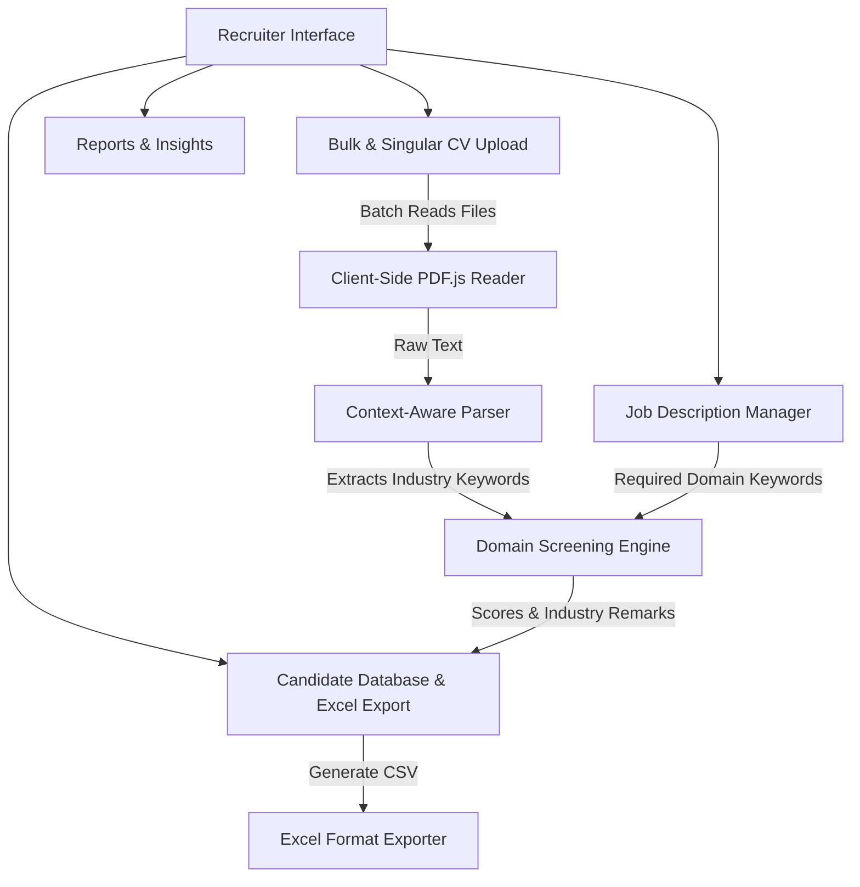

# Hirengine AI - Implementation & Design Plan

This document outlines the detailed architecture, feature set, design guidelines, and data structures for the **Hirengine AI** resume screening web application.

---

## 1. High-Level Architecture & Tech Stack

The application runs fully in-browser, allowing recruiter-side processing of candidate CVs against job descriptions.

### Technology Details:
* **Core**: React 19 + Vite (fast hot module reloading).
* **Styling**: Premium Dark Theme, glassmorphic panels, and smooth transitions.
* **Libraries**:
  * `lucide-react`: Clean, modern, scalable icons.
  * `canvas-confetti`: Confetti micro-interaction for shortlisting.
  * `PDF.js` (loaded via CDN): Directly extracts raw text from PDF CVs.

---

## 2. Updated Core Features & Requirements

### 1. Recruiter Upload Flow (Bulk & Singular)
* **Single Upload**: Recruiter uploads a single CV and maps it to a job description.
* **Bulk Upload**: Recruiter selects multiple files (PDFs, TXT) at once. The system queues them, shows concurrent processing bars, parses them in parallel, and populates the candidate database.

### 2. Context-Aware Experience Matcher (Domain Alignment)
* The matching algorithm evaluates **not just years of experience, but industry context**.
* **Job Profile Settings**: Recruiter specifies the target **Industry Domain** (e.g. *Oil & Gas*, *Railway*, *Information Technology*, *Healthcare*).
* **Domain Keyword Association**:
  * **Oil & Gas**: *petroleum, drilling, refinery, offshore, pipeline, hydrocarbon, gas reservoir, petrochemical, exploration*.
  * **Railway**: *locomotive, rolling stock, signaling, track, train, rail transit, railway infrastructure, carriage, metro*.
* **Scoring Penalty**: If a candidate has 10 years of experience but the keyword scanner detects railway-dominated terms while the job description requires Oil & Gas, the matching score drops significantly.
* **Smart Remarks Generation**: The system flags the mismatch in the "Remarks" column, e.g.:
  > *"Candidate has 8 years of experience, but it is focused in the Railway industry. Lacks the required Oil & Gas domain experience."*

### 3. Excel Export Schema
Recruiters can download a generated Excel-compatible CSV file containing the following columns:
1. **Name** (Parsed from CV head)
2. **Email** (Parsed email address)
3. **Phone** (Parsed contact number)
4. **Candidate Field / Role** (Identified profession)
5. **Years of Experience** (Overall duration)
6. **Relevant Experience** (Duration aligned to active industry domain)
7. **Match Score** (Percentage indicator)
8. **Remarks** (Detailed summary of alignment, listing matched skills and domain mismatches)

---

## 3. Revised Sample Candidate Seed Set

To showcase this domain matching, our preloaded seed data will include candidates with contrasting industry backgrounds:

| Candidate Name | Experience Summary | Industry Domain | Target Role | Expected Match | Remarks / Remarks Field |
| :--- | :--- | :--- | :--- | :--- | :--- |
| **Robert Miller** | 8 years Drilling Engineer at Shell. Petroleum refining and pipeline design. | **Oil & Gas** | Petroleum Pipeline Engineer (Oil & Gas) | **High (94%)** | *8 years of direct Oil & Gas experience. Highly relevant background in petroleum drilling and pipelines.* |
| **Arthur Pendelton** | 8 years Infrastructure Lead at National Rail. Track design, signaling, and carriage systems. | **Railway** | Petroleum Pipeline Engineer (Oil & Gas) | **Low (32%)** | *8 years of experience is in the Railway sector. Lacks required Oil & Gas drilling/refining domain expertise.* |
| **Jane Doe** | 6 years Senior Frontend Engineer. React, TS, Redux. | **Information Tech** | Senior React Developer | **High (92%)** | *6 years of frontend experience. Strong skill alignment with modern web frameworks.* |

---

## 4. Next Steps

Let me know if this updated alignment plan is correct:
1. Does the industry classification (Oil & Gas vs. Railway) cover the core domain requirements you need?
2. Shall I begin building the React application according to this blueprint?
